# 🏦 Finance CV Optimizer

> **AI-powered CV optimization engine for Banking & Finance roles in the MENA region**

[](https://www.python.org/)
[](https://fastapi.tiangolo.com/)
[](https://openai.com/)
[](#-get-the-full-version)

---

> [!IMPORTANT]
> **This repository is a showcase/demo only.**
> The full production-ready backend with complete AI logic, system prompts, and PDF generation is available on Gumroad.
>
> 👉 **[Get the Full Version on Gumroad](https://gumroad.com/l/your-product-link)**

---

## 🎯 What It Does

The Finance CV Optimizer transforms ordinary CVs into **ATS-optimized, interview-winning documents** specifically designed for:

- 💼 **Credit Analysts** — Loan underwriting, portfolio management, NPL analysis
- 📊 **Risk Managers** — Basel compliance, stress testing, regulatory reporting
- 💰 **Finance Professionals** — Financial analysis, budgeting, treasury operations

### Key Capabilities

| Feature | Description |
|---------|-------------|
| **ATS Keyword Optimization** | Extracts and embeds job description keywords for maximum ATS compatibility |
| **Banking-Specific Language** | NPL, Basel III, CBE regulations, IFRS — not generic business jargon |
| **Quantified Achievements** | Transforms vague bullets into impact-driven statements with metrics |
| **MENA Market Context** | Egyptian banks, EGP amounts, regional certifications, local institutions |
| **Structured JSON Output** | Clean, parseable output ready for integration into your platform |

---

## 🔥 The Problem We Solve

Getting hired in banking and finance is brutally competitive:

```
┌─────────────────────────────────────────────────────────────┐
│  ❌ 75% of CVs are rejected by ATS before humans see them  │
│  ❌ Recruiters spend only 6 seconds scanning each CV       │
│  ❌ Generic CV tools fail for specialized banking terms    │
│  ❌ Western tools miss MENA/Egypt market requirements      │
└─────────────────────────────────────────────────────────────┘
```

**This engine solves all of these problems** by combining GPT-4 with deep domain expertise in Finance/Banking hiring for the Egypt and MENA region.

---

## 👥 Who Is This For?

| Audience | Use Case |
|----------|----------|
| **SaaS Founders** | Add CV optimization to your HR/recruitment platform |
| **Agencies** | Offer premium CV services to finance professionals |
| **HR Tech Teams** | Build internal tools for candidate screening |
| **Career Coaches** | Automate CV reviews for banking clients |
| **Developers** | Learn how to build vertical AI tools |

---

## 🏗️ High-Level Architecture

```mermaid
flowchart LR
    subgraph Input
        CV[📄 CV Text]
        JD[📋 Job Description]
        Role[🎯 Role Type]
    end
    
    subgraph Engine["🤖 AI Optimization Engine"]
        Parse[Parse & Analyze]
        Match[Keyword Matching]
        Enhance[Banking Language Enhancement]
        Score[ATS Scoring]
    end
    
    subgraph Output
        JSON[📊 Structured JSON]
        PDF[📑 Formatted PDF]
    end
    
    CV --> Parse
    JD --> Parse
    Role --> Parse
    Parse --> Match --> Enhance --> Score
    Score --> JSON
    JSON --> PDF
    
    style Engine fill:#1a1a2e,stroke:#0f3460,color:#fff
    style JSON fill:#0f3460,stroke:#16537e
    style PDF fill:#0f3460,stroke:#16537e
```



### How It Works

1. **Input**: Submit a raw CV, target job description, and role type
2. **Analysis**: AI extracts keywords, identifies gaps, and maps requirements
3. **Optimization**: Enhances language, adds metrics, restructures for ATS
4. **Output**: Returns structured JSON (and optionally formatted PDF)

---

## 📊 Example Output

The API returns a fully structured JSON response ready for integration:

```json
{
  "success": true,
  "data": {
    "candidate_name": "Ahmed Mohamed Hassan",
    "professional_title": "Senior Credit Analyst",
    "professional_summary": "Results-driven Credit Analyst with 5+ years of experience...",
    "experience": [
      {
        "title": "Credit Analyst",
        "company": "Commercial International Bank (CIB)",
        "period": "Jan 2020 - Present",
        "bullets": [
          "Analyzed 180+ credit applications monthly for SME clients with combined exposure of EGP 350M",
          "Reduced NPL ratio from 4.2% to 2.5% through enhanced early warning monitoring",
          "Prepared credit committee presentations for facilities exceeding EGP 20M"
        ]
      }
    ],
    "skills": {
      "core": ["Credit Risk Assessment", "Financial Statement Analysis", "NPL Management"],
      "technical": ["Excel (Advanced)", "Power BI", "Core Banking Systems"]
    },
    "ats_score": 87,
    "matched_keywords": ["NPL", "credit risk", "Basel III", "loan underwriting"],
    "suggestions": ["Add FRM certification", "Quantify total portfolio size"]
  }
}
```

📁 See [`examples/sample_output.json`](./examples/sample_output.json) for a complete example.

---

## 🛠️ Tech Stack

| Component | Technology |
|-----------|------------|
| **AI Engine** | OpenAI GPT-4 |
| **API Framework** | FastAPI (Python) |
| **Validation** | Pydantic |
| **Output** | Structured JSON + PDF |

---

## 📂 Repository Contents

This showcase repository contains:

```
github-showcase/
├── README.md              ← You are here
├── assets/
│   └── architecture.md    ← Detailed architecture explanation
├── examples/
│   └── sample_output.json ← Example API response
└── src/demo/
    ├── models.py          ← Data models (interface only)
    └── interfaces.py      ← API interfaces (stubs only)
```

> [!NOTE]
> The code in this repository is for **demonstration purposes only**.
> It shows the structure and interfaces but is **not functional** without the full implementation.

---

## 🚀 Get the Full Version

The complete production-ready package includes:

✅ **Full AI Agent Logic** — Complete optimization engine with banking prompts  
✅ **FastAPI Backend** — Production-ready REST API  
✅ **PDF Generation** — Formatted CV export  
✅ **Configuration System** — Easy setup with environment variables  
✅ **Documentation** — Complete setup and customization guide  
✅ **Commercial License** — Use in your own products and services  

### What You Get

- Clean, documented Python source code
- Deploy on your own infrastructure
- Modify and customize as needed
- Build commercial products on top of it

---

<div align="center">

## 💰 Ready to Build Your CV Optimization Product?

[](https://gumroad.com/l/your-product-link)

**One-time purchase. Full source code. Commercial license included.**

</div>

---

## 📄 License

This showcase repository is provided for demonstration purposes only.

The full source code is available for purchase on Gumroad with a commercial license that allows you to:
- ✅ Use in commercial products
- ✅ Modify the code
- ✅ Deploy on your servers
- ❌ Redistribute the source code

---

## 🤝 Questions?

Interested in the full version or have questions?

- 📧 Contact through Gumroad after purchase
- ⭐ Star this repo if you find it useful!

---

<div align="center">

**Built for the MENA banking market. Ready to power your next product.**

</div>
