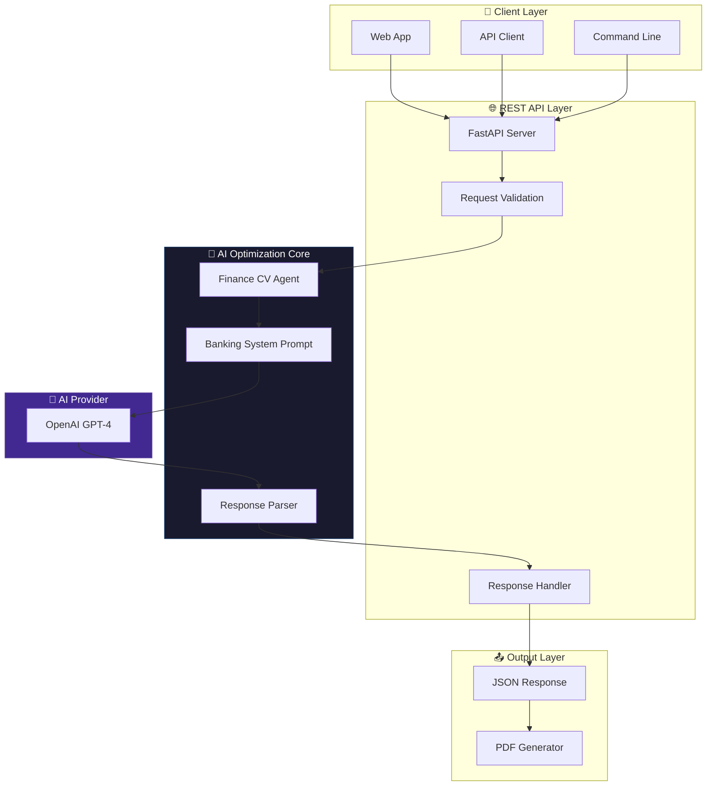
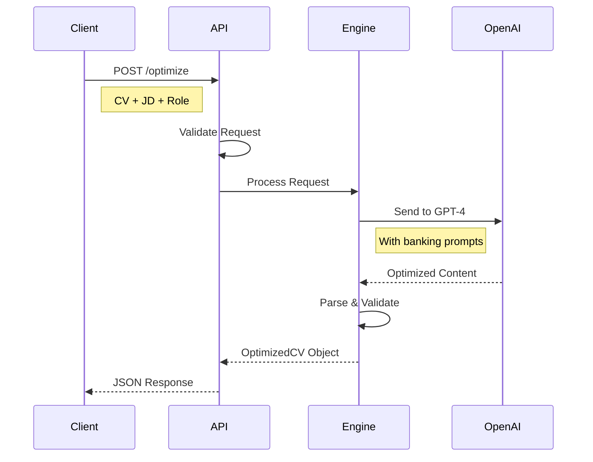

# Architecture Overview

> [!NOTE]
> This document provides a high-level architectural overview.
> The full implementation details are available in the [production version on Gumroad](https://gumroad.com/l/your-product-link).

---

## System Flow



---

## Component Breakdown

### 1. API Layer (FastAPI)

The REST API provides a clean interface for CV optimization:

| Endpoint | Method | Description |
|----------|--------|-------------|
| `/` | GET | API information |
| `/health` | GET | Health check |
| `/optimize` | POST | Main CV optimization endpoint |
| `/roles` | GET | List available role types |

### 2. AI Agent Core

The heart of the system — a specialized agent that:

- Parses CV content and job descriptions
- Applies banking/finance domain knowledge
- Optimizes for ATS compatibility
- Returns structured, validated output

```
┌──────────────────────────────────────────────┐
│              Finance CV Agent                │
├──────────────────────────────────────────────┤
│  • Role-specific optimization                │
│  • MENA/Egypt market context                 │
│  • ATS keyword extraction & placement        │
│  • Quantified achievement generation         │
│  • Banking terminology enhancement           │
└──────────────────────────────────────────────┘
```

### 3. Output Generation

Two output formats supported:

1. **JSON** — Structured data for programmatic use
2. **PDF** — Formatted document for direct use

---

## Data Flow



---

## Role-Specific Processing

The engine adapts its optimization strategy based on the target role:

| Role Type | Focus Areas | Key Terms |
|-----------|-------------|-----------|
| **Finance** | Reporting, budgeting, treasury | IFRS, ERP, variance analysis |
| **Credit Analyst** | Lending, underwriting, NPL | Credit scoring, collateral, Basel |
| **Risk Manager** | Compliance, audit, stress testing | CAR, CBE regulations, ICAAP |

---

## Technology Stack

| Layer | Technology | Purpose |
|-------|------------|---------|
| API | FastAPI | High-performance async REST API |
| Validation | Pydantic | Request/response validation |
| AI | OpenAI GPT-4 | Natural language processing |
| Output | ReportLab* | PDF generation |

*PDF generation included in full version only.

---

## Get the Full Architecture

This overview shows the high-level design. The full implementation includes:

- Complete system prompts with banking domain expertise
- Full API implementation with error handling
- PDF generation with professional formatting
- Configuration management
- Production deployment guides

👉 **[Get the Full Version on Gumroad](https://gumroad.com/l/your-product-link)**
